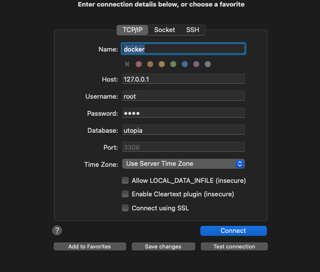
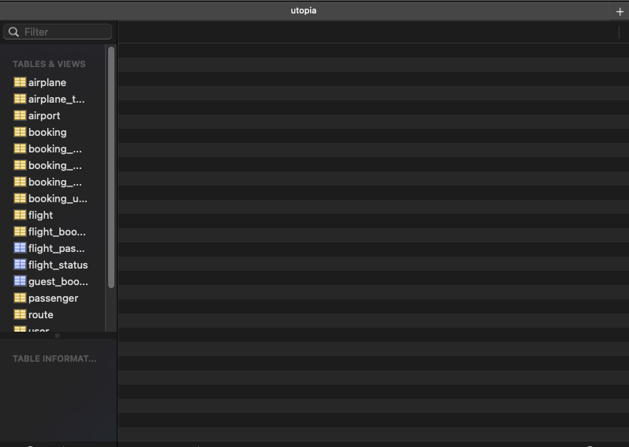
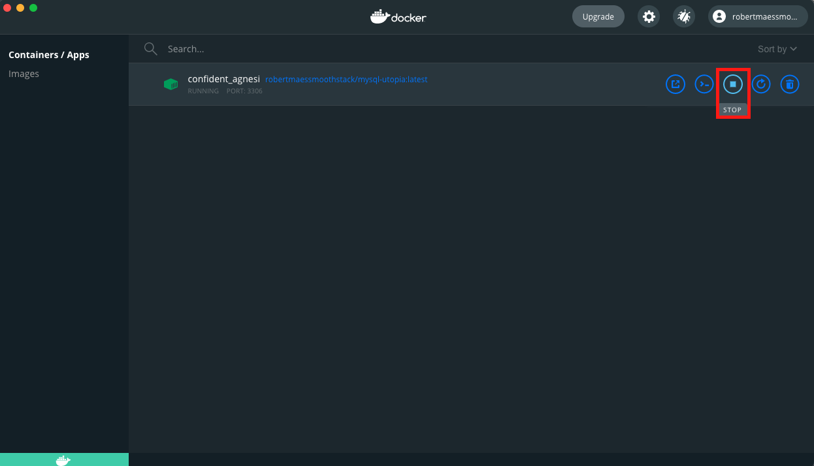
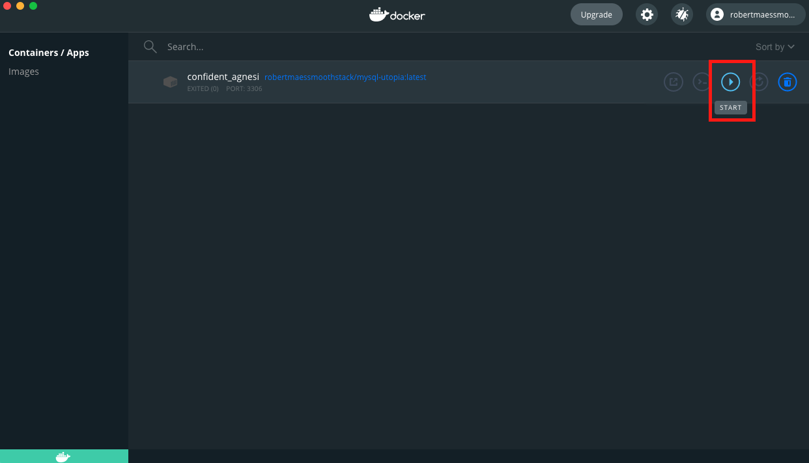

# How to Use this Docker Database

### Install Docker

Before you can use Docker you need to install it.
Download Docker Desktop for your Operating System here: https://www.docker.com/products/docker-desktop

### Obtaining the Image

The docker image is stored on dockerhub with the name `robertmaessmoothstack/mysql-utopia`

Run the following command in your terminal: `docker pull robertmaessmoothstack/mysql-utopia`

After running the command you should see an output similar to this:

If you open up the Docker Desktop application you should now also see the image:

### Creating a Container from the Image

Now that we have the Docker image, we need to create a container. This can be done from the terminal or from the Docker Desktop GUI.

---

**Important! Before running the docker container you must stop running your local MySQL server otherwise the ports will conflict.**

---

**Terminal:** Run the following command: `docker run -p 3306:3306 robertmaessmoothstack/mysql-utopia`

**GUI:** Open the Docker Desktop app and go to the "Images" tab. Hover over "robertmaessmoothstack/my..." and click on the "Run" button

Expand the "Optional Settings" and under Ports > "Local Host" enter `3306`. Then click run.

If all goes well you should now see a container with a random name running under the "Containers / Apps" tab.

### Connecting to the Containerized Database

Using your favorite MySQL Database browsing tool, you should now be able to connect to the docker database with the following information:

**Host:** `127.0.0.1`

**Username:** `root`

**Password:** `root`

**Database:** `utopia`

**Port:** `3306`

Upon connecting you should be able to view the pre-defined schema

### Stop Running the Container

To stop running the container open up the Docker Desktop application. Go to "Containers / Apps". Hover over your container and press the "stop" button.

### Start Runnning the Container

To start running the container open up the Docker Desktop application. Go to "Containers / Apps". Hover over your container and press the "start" button.

**Make sure you are not running a MySQL server locally!**

### Updating the image

If changes are made to the schema you will need to update your image and thus your container.

Open the Docker Desktop application and go to the "Images" tab.

Hover over the "robertmaessmoothstack/..." image and click on the 3 vertical dots. Then click "pull".
